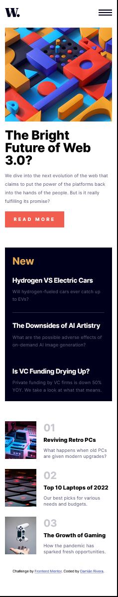
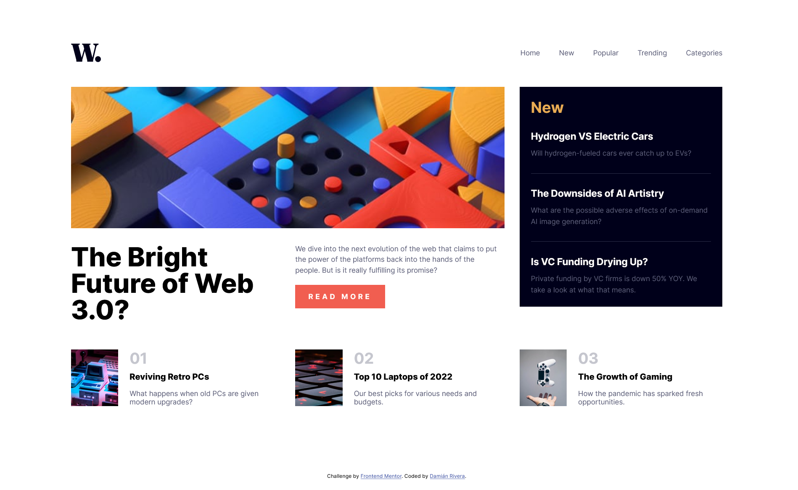

# Frontend Mentor - News homepage solution

This is a solution to the [News homepage challenge on Frontend Mentor](https://www.frontendmentor.io/challenges/news-homepage-H6SWTa1MFl).

## Table of contents

- [Frontend Mentor - News homepage solution](#frontend-mentor---news-homepage-solution)
  - [Table of contents](#table-of-contents)
  - [Overview](#overview)
    - [The challenge](#the-challenge)
    - [Screenshot](#screenshot)
    - [Links](#links)
  - [My process](#my-process)
    - [Built with](#built-with)
    - [What I learned](#what-i-learned)
    - [Continued development](#continued-development)
  - [Author](#author)

## Overview

### The challenge

Users should be able to:

- View the optimal layout for the interface depending on their device's screen size
- See hover and focus states for all interactive elements on the page
- **Bonus**: Toggle the mobile menu (requires some JavaScript)

### Screenshot

### Links

- Solution URL: [Homepage code](https://github.com/DamianRi/news-homepage-main)
- Live Site URL: [Homepage live](https://damianri.github.io/news-homepage-main/)

## My process

### Built with

- Semantic HTML5 markup
- SCSS custom properties
- Flexbox
- CSS Grid
- Mobile-first workflow

### What I learned

I practiced the templates for mobile and for desktop devices, specifically a template with 'grid' property.

**Note: Delete this note and the content within this section and replace with your own learnings.**

### Continued development

I will continue practicing more design patterns.

## Author

- Website - [Still working on](https://www.---.com)
- Frontend Mentor - [@DamianRi](https://www.frontendmentor.io/profile/DamianRi)
